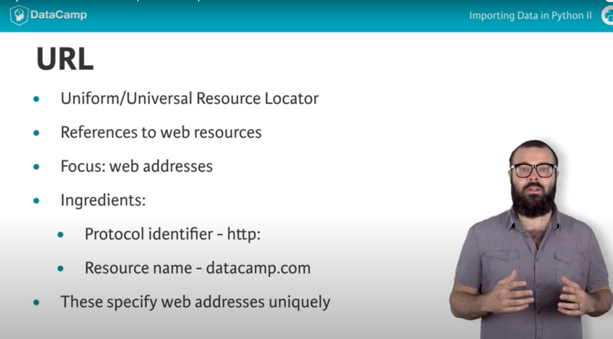
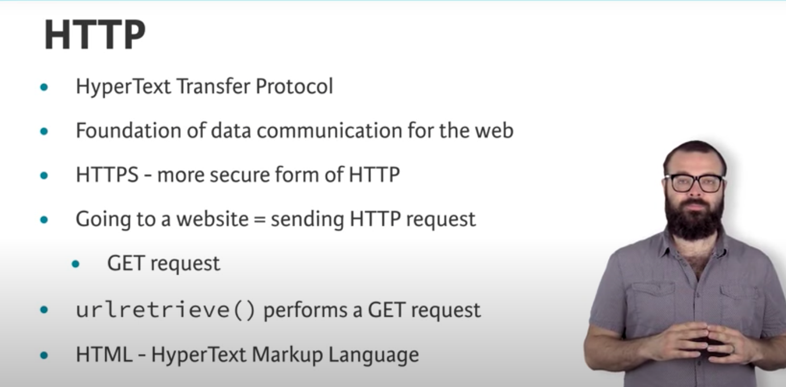
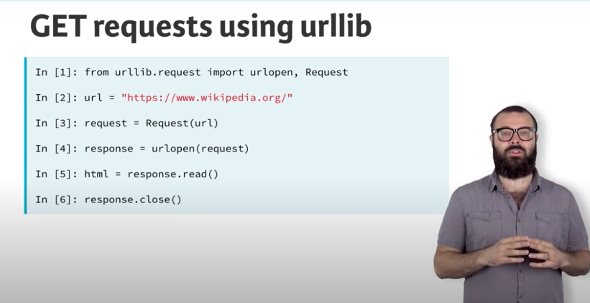
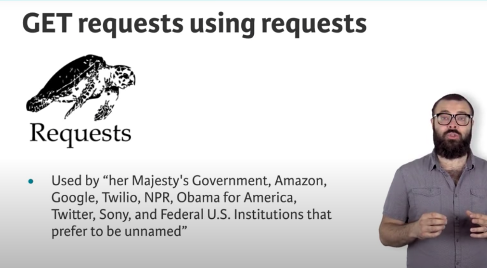

# 2.2 Youtube-HTTP requests to import data from the web

`requests` is different from `urllib`. It's simpler, but I have learned Bilibili course, so still, choose `urllib`.

for python3, `import urllib.request` 

`urllib`见douban\_重写\_1.py

Finished.

