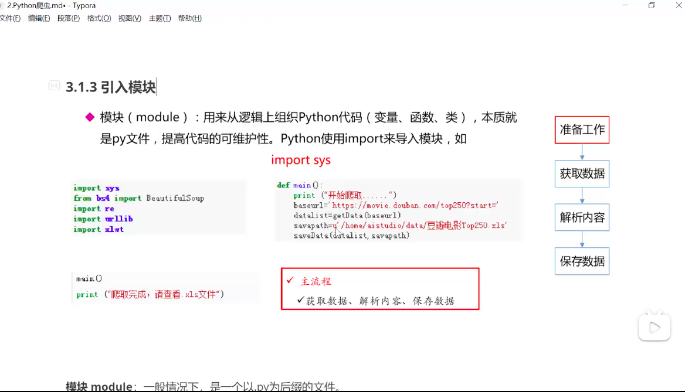
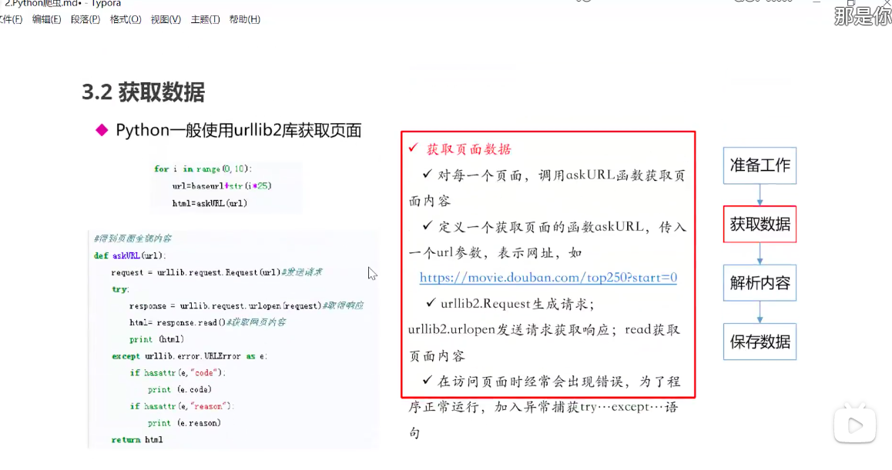
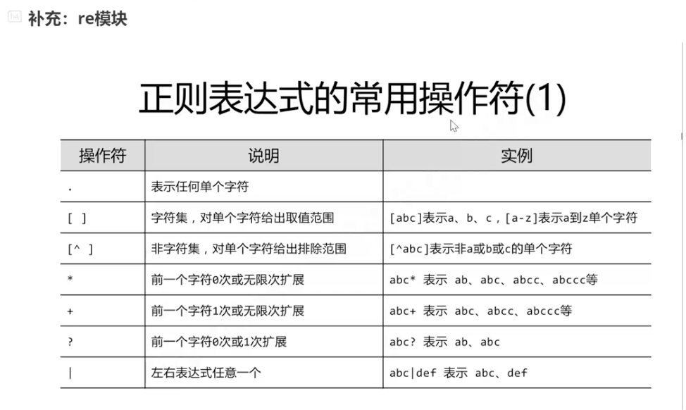
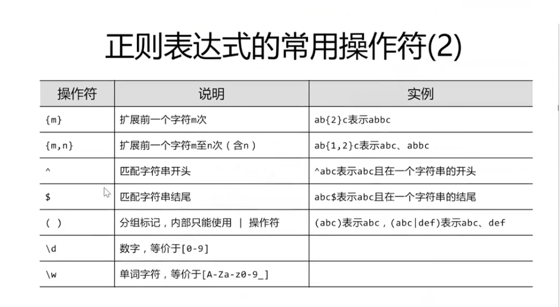
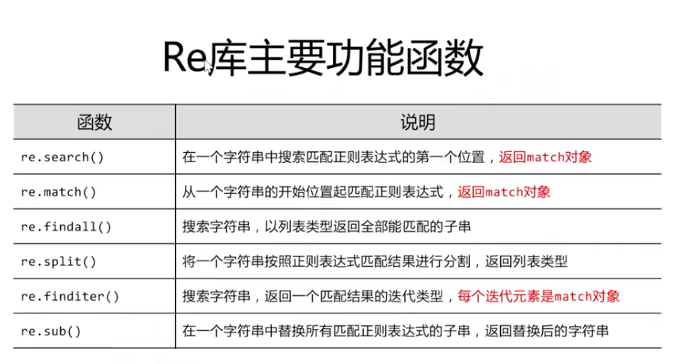
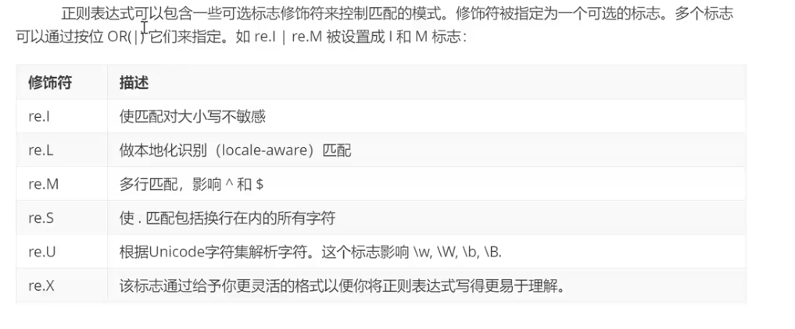
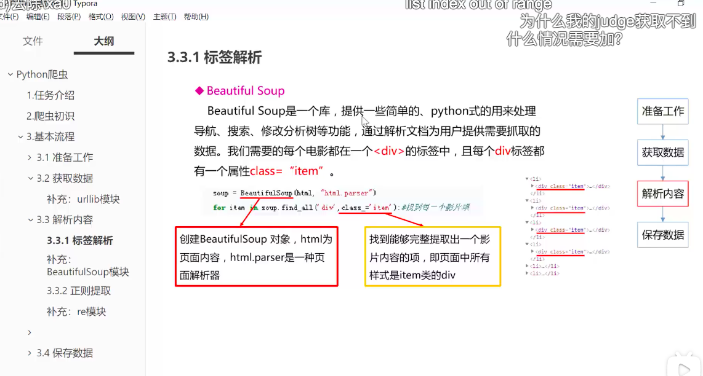

# 3. Bilibili course-parse website data

https://movie.douban.com/top250?start=100&filter=

右键，源代码

右键，检查

#### 3.1 编码规范

python第一行，加入`#-*- coding = utf-8 -*-` 或者`# coding=utf-8` ，以在代码中包含中文。

使用函数实现单一功能或者相关联功能的代码段，提高可读性和代码重复利用率。函数代码段以def关键词开头，后接空格、函数标示符名称、\(\)、:，括号中可以传入参数，函数段缩进。return结束函数，可以返回一个值也可以不带任何表达式，即返回None。

python文件中加入main函数，以测试程序，`if_name_ == "_main_"` 

python文件使用`#` 添加注释，以说明代码（段）的作用。


Command + ?，自动注释选中的python文件

再Command + ?，取消注释


#### 3.2 引入模块module

module本质是py文件，可以理解为第三方的库，即外部写好的源代码。

python使用import来导入模块。

`from 文件夹 import 模块／函数` `import 模块` 引入第三方／自定义的模块（这里的模块，通常可以理解为py文件）

`import sys` `import os` 引入系统模块

`import sys` 

`from bs4 import BeautifulSoup` \#网页解析，获取数据

`import re` \#正则表达式，进行文字匹配

`import urllib` \#指定URL，获取网页数据


`import urllib.request` 我的电脑上，需要在`urllib` 之后加一个`request` 


`import xlwt` \#进行excel操作

`import squlite3` \#进行SOLite数据库操作

模块，如`bs4` 需要在终端下载，

```text
(base) nanzhendeMacBook-Air:~ nanzhen$ pip install bs4
>>> Requirement already satisfied: bs4 in ./opt/miniconda3/lib/python3.8/site-packages (0.0.1)
>>> Requirement already satisfied: beautifulsoup4 in ./opt/miniconda3/lib/python3.8/site-packages (from bs4) (4.9.3)
>>> Requirement already satisfied: soupsieve>1.2; python_version >= "3.0" in ./opt/miniconda3/lib/python3.8/site-packages (from beautifulsoup4->bs4) (2.0.1)
>>> (base) nanzhendeMacBook-Air:~ nanzhen$ 
```



#### 3.3 获取数据



#### 3.4 正则表达式





\s的问题，可再参考下一链接以进行学习

https://mayuanucas.github.io/2020/07/04/%E6%AD%A3%E5%88%99%E8%A1%A8%E8%BE%BE%E5%BC%8F%E5%85%A5%E9%97%A8/ 





#### 3.5 解析内容




#### 

#### 

#### 

#### 

#### 

#### References

https://www.bilibili.com/video/BV12E411A7ZQ?p=16

https://blog.csdn.net/llllllkkkkkooooo/category\_10129586.html  ——未看

