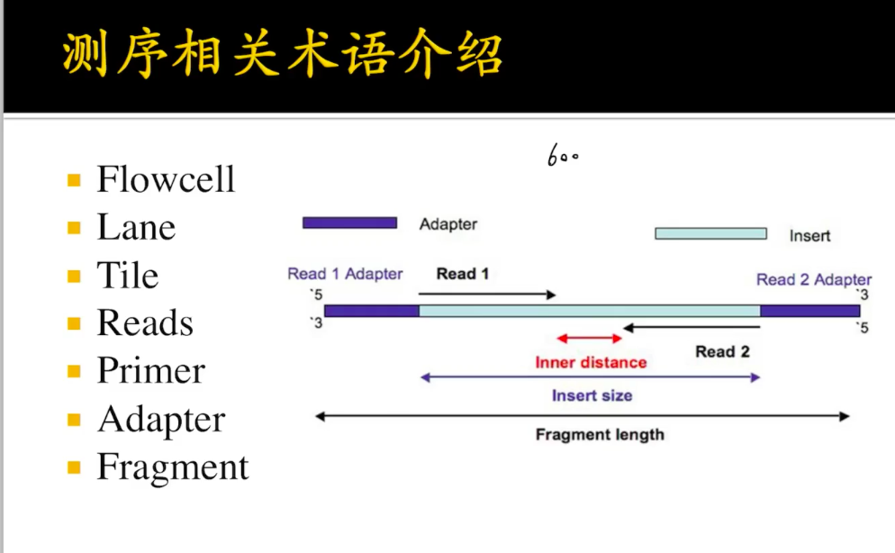

# 2. BILIBILI鲮鱼不会飞+ 关注稿件：20

## PKU

## 1. Illumina sequencing

### before Illumina sequencing, it is?

it's Sanger sequencing.

### currently, Next Generation Sequencing is?

is Illumina sequencing.

### bp

## 2. Bioinformatics

### is bio or info more important?

bio is more important, info is a tool.

### how to start bioinformatics?

Linux, coding, statistics \(difficult but important\), and bio.

Linux, `cat vim less` , `cp mv` 

Python, script, Shell, R

### what basic bio info should we know?

sequencing, 

一般，双端测序，如一个600bp的fragment，左边测150read，右边150read，合在一起，虽然有300没有测，但还是可以确定一个fragment。

所以，FPKM，RPKM的区别是？

FPKM= 1/2 FPKM，因为两条reads确定一个fragment

#### the less command in Linux?

#### how to code in bioinformatics? where to find the practice?

