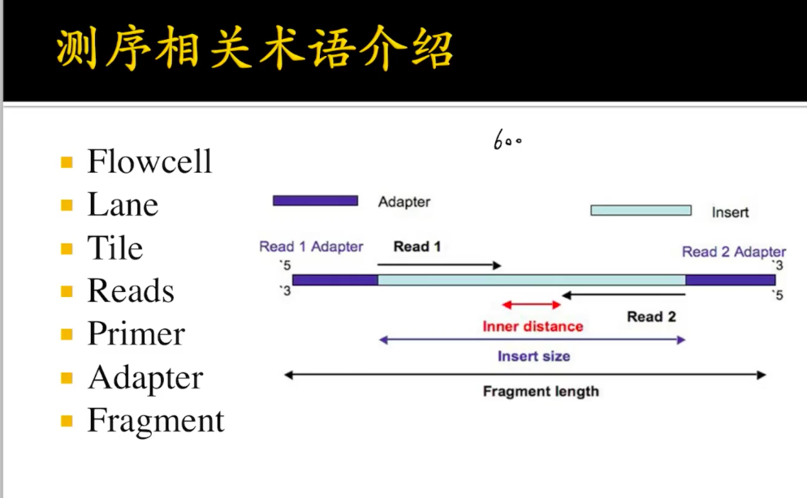
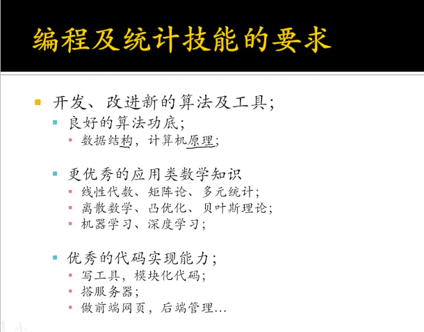

# 2. BILIBILI鲮鱼不会飞+ 关注稿件：20

## Bioinformatics

### is bio or info more important?

bio is more important, info is a tool.

### how to start bioinformatics?

Linux, coding, statistics \(difficult but important\), and bio.

Linux, `cat vim less` , `cp mv` 

Python, script, Shell, R

statistics + R = 95%

### what basic bio info should we know?

sequencing, 

一般，双端测序，如一个600bp的fragment，左边测150read，右边150read，合在一起，虽然有300没有测，但还是可以确定一个fragment。

所以，FPKM，RPKM的区别是？

FPKM= 1/2 FPKM，因为两条reads确定一个fragment

### how long it will take?

one year - a technician

two years and patience - expert

time, gift, hardwork - more

### what's the advanced bioinformatics ability?

#### the less command in Linux?

#### how to code in bioinformatics? where to find the practice?

#### References

https://space.bilibili.com/14581898?spm\_id\_from=333.788.b\_765f7570696e666f.1

